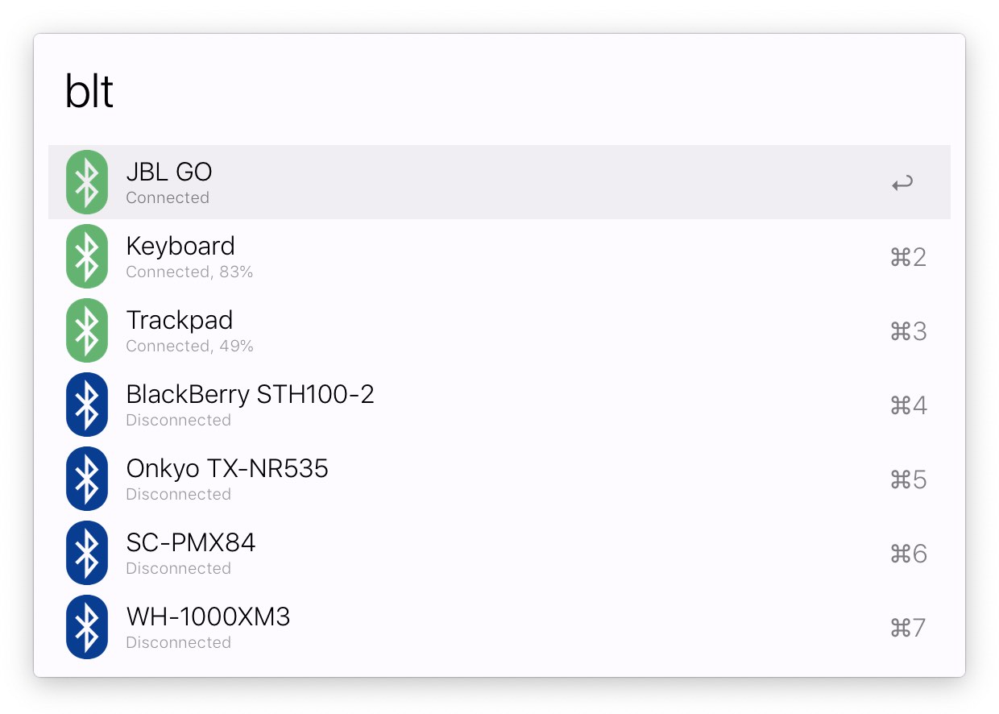

# Alfred Bluetooth Workflow

[](https://opensource.org/licenses/MIT)

[Alfred 3](https://www.alfredapp.com/) workflow to quickly connect / disconnect Bluetooth devices.

## Installation

Simply download the latest [`Bluetooth Connector.alfredworkflow`](https://github.com/tilmanginzel/alfred-bluetooth-workflow/releases)
 release and double-click to import into Alfred. 

Note regarding MacOS 10.15 (Catalina): Since MacOS 10.15, [Notarization](https://developer.apple.com/documentation/security/notarizing_your_app_before_distribution) is required for apps.
As this workflow and its distributed binaries are not notarized, please try the following workaround:

- Install an [old version](https://github.com/tilmanginzel/alfred-bluetooth-workflow/releases/download/v0.4.0/Bluetooth.Connector.alfredworkflow) of the workflow
- Update via `blt workflow:update`

See [#9](https://github.com/tilmanginzel/alfred-bluetooth-workflow/issues/9) for more information and other possible [workarounds](https://github.com/tilmanginzel/alfred-bluetooth-workflow/issues/9#issuecomment-539647706).

## Features

* Connect / disconnect to any known Bluetooth device by typing `blt {device}`
  * Optionally filter devices by name
  * Already connected devices are highlighted with a green icon
* Toggle Bluetooth on or off via `blt-on`, `blt-off` or simply `blt-toggle`
* Workflow updates via `blt workflow:update` (Thanks to @trietsch)
* Desktop notifications for all commands and their results
  * Failed commands can be retried by simply clicking on the notification




## Attribution

* [trietsch/alfred-bluetooth-connector](https://github.com/trietsch/alfred-bluetooth-connector) by Robin Trietsch was used as an inspiration for this workflow implementation.
* [toy/blueutil](https://github.com/toy/blueutil) is used to easily connect/disconnect a Bluetooth device by its MAC address and toggle Bluetooth on/off. It was originally developed by Frederik Seiffert and is now being continued by Ivan Kuchin.
* [julienXX/terminal-notifier](https://github.com/julienXX/terminal-notifier) is used to show a notification of the result for each command.

## License

```
The MIT License (MIT)

Copyright (c) 2018 - 2019 Tilman Ginzel, Robin Trietsch

Permission is hereby granted, free of charge, to any person obtaining a copy
of this software and associated documentation files (the "Software"), to deal
in the Software without restriction, including without limitation the rights
to use, copy, modify, merge, publish, distribute, sublicense, and/or sell
copies of the Software, and to permit persons to whom the Software is
furnished to do so, subject to the following conditions:

The above copyright notice and this permission notice shall be included in all
copies or substantial portions of the Software.

THE SOFTWARE IS PROVIDED "AS IS", WITHOUT WARRANTY OF ANY KIND, EXPRESS OR
IMPLIED, INCLUDING BUT NOT LIMITED TO THE WARRANTIES OF MERCHANTABILITY,
FITNESS FOR A PARTICULAR PURPOSE AND NONINFRINGEMENT. IN NO EVENT SHALL THE
AUTHORS OR COPYRIGHT HOLDERS BE LIABLE FOR ANY CLAIM, DAMAGES OR OTHER
LIABILITY, WHETHER IN AN ACTION OF CONTRACT, TORT OR OTHERWISE, ARISING FROM,
OUT OF OR IN CONNECTION WITH THE SOFTWARE OR THE USE OR OTHER DEALINGS IN THE
SOFTWARE.
```
